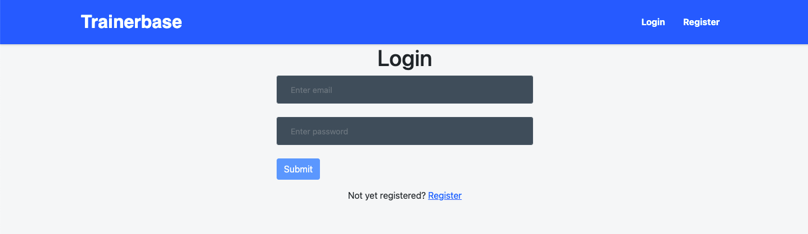
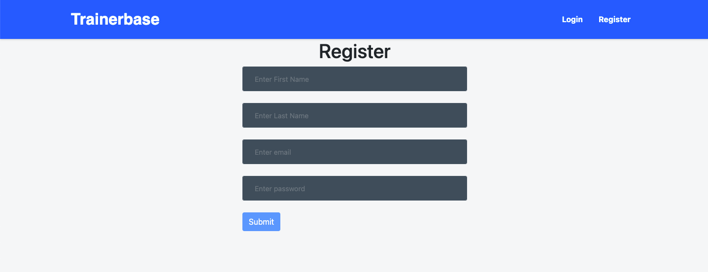
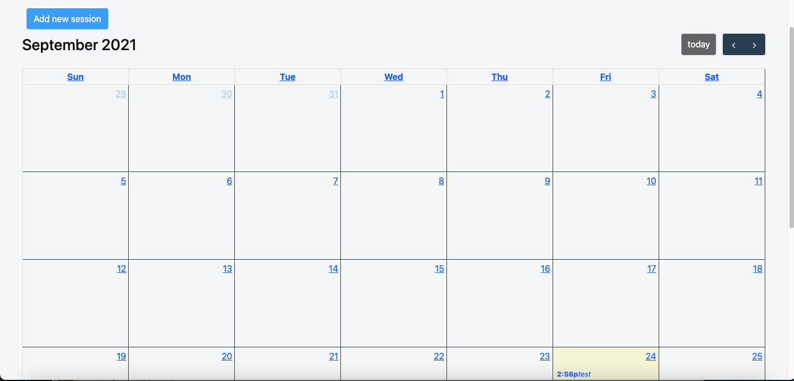
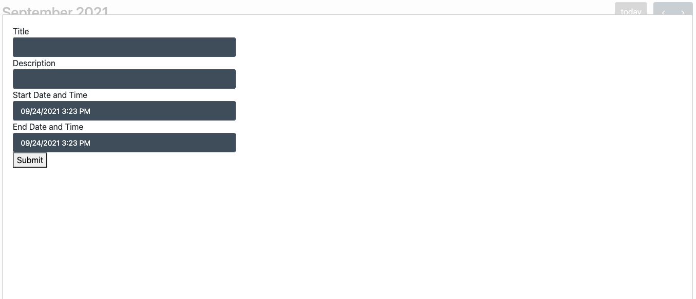

<h1 align="center">Trainerbase App</h1>

An online application for personal trainers to schedule their training sessions with their clients

## Links

- [Repo - Frontend](https://github.com/doomvell13/trainerbase-frontend)

- [Repo - Backend](https://github.com/doomvell13/trainerbase-backend)

- [App - Heroku](https://trainerbase-frontend.herokuapp.com/ 'App')

## Screenshots

### Login Page

### Register Page

### Calendar Page

### Add Session

## Instructions

1. Register and create an account to use the app.
2. Login upon completion on registering.
3. Click on add session button to add session.
4. Input the title, description, start date & time and end date & time.

## Available Routes

In the project directory, you can access:

### `User`

- Register
- Login
- Add Session
- Edit Session
- Delete Session

## Built With

- NestJs(Typescript)
- MongoDB
- React
- Mongoose
- Moment (date handling)
- Bootstrap
- JSON web token

## Future Updates

- [ ] Additional field to select client while adding session
- [ ] Ability to send client email to register account to view their sessions
- [ ] More calendar views(weekly and day views)
- [ ] Drag and drop with prefill client details
- [ ] Integration with Google Calendar
- [ ] Ability for client to approve sessions once session is completed
- [ ] Ability for client to request change session if they can't make it for that particular session
- [ ] Ability for trainers to manage sessions payment and indicate if it's time for renewal

## Author

**Anthony Ong**

- [Profile](https://github.com/doomvell13)
